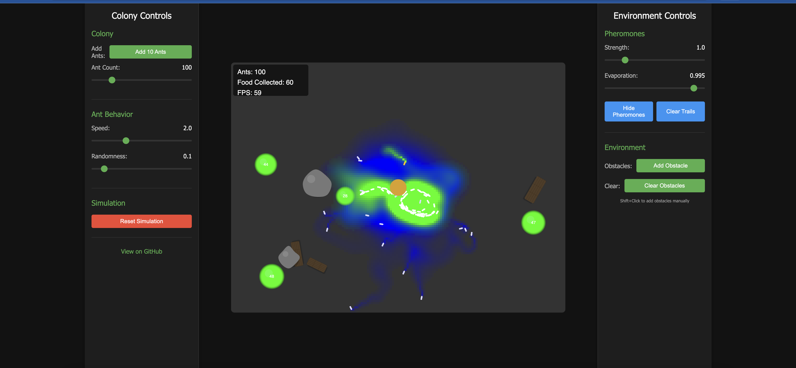

# Ant Colony Simulation

An interactive ant colony optimization simulation built with p5.js.



## Live Demo

You can access the live simulation here: [https://tsdocode.github.io/vibe-ant-colony/](https://tsdocode.github.io/vibe-ant-colony/)

(Note: Update the URL with your actual GitHub username once deployed)

## Features

- **Emergent Behavior**: Watch as ants collectively find optimal paths between their nest and food sources
- **Pheromone Trails**: Visualize the pheromone trails that ants use to communicate
- **Interactive Controls**: Adjust simulation parameters in real-time
- **Food Collection**: Ants search for food and bring it back to the nest
- **Obstacle Avoidance**: Place obstacles to see how the colony adapts
- **Random Behavior**: Some ants explore randomly, potentially finding new food sources

## Controls

The simulation features comprehensive controls divided between left and right panels:

### Left Panel (Colony Controls)
- Add ants to the simulation
- Adjust the ant count
- Change ant speed
- Control random behavior rate

### Right Panel (Environment Controls)
- Adjust pheromone strength
- Set pheromone evaporation rate
- Toggle pheromone visibility
- Add and clear obstacles

## Interaction

- **Click** on the canvas to add food
- **Shift+Click** to add obstacles
- Click on existing food or obstacles to remove them

## How It Works

This simulation demonstrates the principles of ant colony optimization:

1. Ants initially move randomly in search of food
2. When food is found, ants return to the nest leaving a pheromone trail
3. Other ants are more likely to follow stronger pheromone trails
4. Pheromones evaporate over time, shorter paths maintain stronger trails
5. The colony naturally converges on optimal paths to food sources

## Local Development

To run the simulation locally, you can use any local server. For example:

```bash
# Using Python
python -m http.server

# Or using Node.js and a package like http-server
npx http-server
```

Then open your browser to `http://localhost:8000` (or whatever port your server uses).

## License

MIT License

## Acknowledgments

This project is inspired by ant colony optimization algorithms and natural swarm intelligence. 